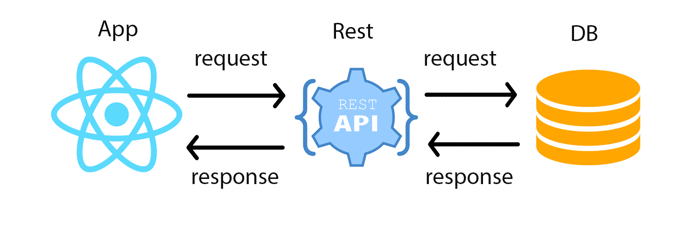

export { default as theme } from './theme'
import Layout from './ImageLayout'

# Assistente Virtual - ISA 

---

# Luis Filipe Alves de Oliveira

# Desenvolvedor React Native - Stratum || Santo Social

 Github: www.github.com/lfoliveir4

 Linkedin: www.linkedin.com/in/lf-oliveira/

---

# Conceito

O ISA foi um projeto iniciado pelo ex-aluno da Faculdade Barretos, Adriano Robson de Andrade. 

Devido a grande importancia do projeto e usabilidade, decidi fazer a continuação do mesmo readaptando não só para o foco principal que seria deficientes visuais, mas para pessoas com deficiência ou não. 

---

# Visão Geral

- Iterativo, incremental e evolutivo.

- Comunicação eficiente para com qualquer tipo de usuário.

- Foco na qualidade e melhor experiência de UX. 

---

# Principios 

- Satisfação dos usuários. 

- Facilidade de uso.

- Design Iterativo. 

- Consultas rápidas e objetivas. 

- A construção de um software valioso. 

---

# Busca de Leis com o ISA

---

# Por que API REST?

Agilidade: 
- Um dos fatores que é mais levado em conta na decisão por implementar serviços REST, se dá ao fato da necessidade que temos de que sistemas estejam sempre disponíveis e que tenham processamento rápido de requisições.

Flexibilidade: 
- Os bodies podem ser implementados usando de várias sintaxes distintas, como:  XML, JSON, e RSS. O desenvolvedor, pode optar pelo formato mais adequado ao tipo de mensagens trocadas pelo sistema de acordo com a sua necessidade, garantindo uma certa flexibilidade durante o desenvolvimento de serviços.

Praticidade: 
- É um protocolo simples de entender podendo ser adotado em praticamente qualquer cliente ou servidor com suporte a HTTP/HTTPS (GET, POST, PUT, DELETE).

---

# Por que React Native  ?

*Learn Once, write anywhere*

Compatibilidade com plataformas.
- O React Native possibilidade app's para Android e IOS com a mesma base de código.

Agilide no Desenvolvimento
- Utilização de componentes.
- Não fica preso as IDE's nativas (Android Studio, XCode)
- React usa Fast Refresh para atualizar modificações no codigo.

Performatico.
- As marcações JSX do React Native são traduzidas para API's nativas (Java, Objective-C), promovendo uma experiência totalment nativa e de altissima perfomance.   

---

# Por que a cor roxa?

#993399

- A cor roxa possibilita que a pessoa tendo uma deficiencia ou não pode ter uma UX de qualidade.

---

# Daltonistas

- Adaptação da aplicação para qualquer tipo de daltonista com uma UI/UX de qualidade.

---

export default Layout

Visão normal:

---

export default Layout

Visão Deuteranopia:

---

export default Layout

Visão Protanopia:

---

export default Layout

Visão Tritanopia:

---

export default Layout

Visão Grayscale:

---

Deficientes visuais

- Telas com voz. 
- Telas que vibram.

---

Pessoas sem deficiencia

- Aplicação intuitiva e obejtiva.
- Cores harmonicas.
- Opção de ouvir a lei ou não.

---

# App

codigo id: 8 - código de defesa do consumidor

codigo id: 9 - código de processo civil

codigo id: 10 - código de trânsito brasileiro
  

codigo id: 17 - consolidação das leis do trabalho

codigo id: 19 - código civil
 
 
codigo id: 22 - código de processo penal

codigo id: 24 - Código penal

codigo id: 25 - estatuto da criança e do adolescente

codigo id: 26 - estatuto da pessoa com deficiência

---

Repository

# www.github.com/lfoliveir4/assistant-isa

---

# Obrigado !

